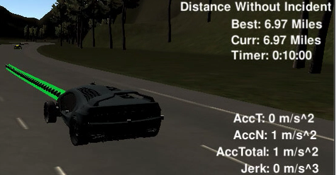
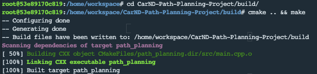

# CarND-Path-Planning-Project
Self-Driving Car Engineer Nanodegree Program

  

### Simulator.
You can download the Term3 Simulator which contains the Path Planning Project from the [releases tab (https://github.com/udacity/self-driving-car-sim/releases/tag/T3_v1.2).  

To run the simulator on Mac/Linux, first make the binary file executable with the following command:
```shell
sudo chmod u+x {simulator_file_name}
```

### Goals
In this project your goal is to safely navigate around a virtual highway with other traffic that is driving +-10 MPH of the 50 MPH speed limit. You will be provided the car's localization and sensor fusion data, there is also a sparse map list of waypoints around the highway. The car should try to go as close as possible to the 50 MPH speed limit, which means passing slower traffic when possible, note that other cars will try to change lanes too. The car should avoid hitting other cars at all cost as well as driving inside of the marked road lanes at all times, unless going from one lane to another. The car should be able to make one complete loop around the 6946m highway. Since the car is trying to go 50 MPH, it should take a little over 5 minutes to complete 1 loop. Also the car should not experience total acceleration over 10 m/s^2 and jerk that is greater than 10 m/s^3.

#### The map of the highway is in data/highway_map.txt
Each waypoint in the list contains  [x,y,s,dx,dy] values. x and y are the waypoint's map coordinate position, the s value is the distance along the road to get to that waypoint in meters, the dx and dy values define the unit normal vector pointing outward of the highway loop.

The highway's waypoints loop around so the frenet s value, distance along the road, goes from 0 to 6945.554.

## Basic Build Instructions

1. Clone this repo.
2. Make a build directory: `mkdir build && cd build`
3. Compile: `cmake .. && make`
4. Run it: `./path_planning`.

Here is the data provided from the Simulator to the C++ Program

#### Main car's localization Data (No Noise)

| **Input** | Definition |
|:---------:|:---------:|
| x | Car's x position in map coordinates |
| y | Car's y position in map coordinates |
| s | Car's s position in frenet coordinates |
| d | Car's d position in frenet coordinates |
| yaw | Car's yaw angle in the map |
| speed | Car's speed in MPH|

#### Previous path data given to the Planner

| **Input** | Definition |
|:---------:|:---------:|
| previous_path_x | Previous list of x points previously given to the simulator |
| previous_path_y | Previous list of y points previously given to the simulator |

#### Previous path's end s and d values 

| **Input** | Definition |
|:---------:|:---------:|
| end_path_s | Previous list's last point's frenet s value |
| end_path_d | Previous list's last point's frenet d value |

#### Sensor Fusion Data, a list of all other car's attributes on the same side of the road. (No Noise)

["sensor_fusion"] A 2d vector of cars and then that car's [car's unique ID, car's x position in map coordinates, car's y position in map coordinates, car's x velocity in m/s, car's y velocity in m/s, car's s position in frenet coordinates, car's d position in frenet coordinates. 

## Details

1. The car uses a perfect controller and will visit every (x,y) point it recieves in the list every .02 seconds. The units for the (x,y) points are in meters and the spacing of the points determines the speed of the car. The vector going from a point to the next point in the list dictates the angle of the car. Acceleration both in the tangential and normal directions is measured along with the jerk, the rate of change of total Acceleration. The (x,y) point paths that the planner recieves should not have a **total acceleration** that goes over **10 m/s^2**, also the **jerk** should not go over **50 m/s^3**.

2. There will be some latency between the simulator running and the path planner returning a path, with optimized code usually its not very long maybe just 1-3 time steps. During this delay the simulator will continue using points that it was last given, because of this its a good idea to store the last points you have used so you can have a smooth transition. previous_path_x, and previous_path_y can be helpful for this transition since they show the last points given to the simulator controller with the processed points already removed. You would either return a path that extends this previous path or make sure to create a new path that has a smooth transition with this last path.
---

## Dependencies

* cmake >= 3.5
  * All OSes: [click here for installation instructions](https://cmake.org/install/)
* make >= 4.1
  * Linux: make is installed by default on most Linux distros
  * Mac: [install Xcode command line tools to get make](https://developer.apple.com/xcode/features/)
  * Windows: [Click here for installation instructions](http://gnuwin32.sourceforge.net/packages/make.htm)
* gcc/g++ >= 5.4
  * Linux: gcc / g++ is installed by default on most Linux distros
  * Mac: same deal as make - [install Xcode command line tools]((https://developer.apple.com/xcode/features/)
  * Windows: recommend using [MinGW](http://www.mingw.org/)
* [uWebSockets](https://github.com/uWebSockets/uWebSockets)
  * Run either `install-mac.sh` or `install-ubuntu.sh`.
  * If you install from source, checkout to commit `e94b6e1`, i.e.
    ```
    git clone https://github.com/uWebSockets/uWebSockets 
    cd uWebSockets
    git checkout e94b6e1
    ```

## Cubic Spline interpolation in C++  
I used a helper function called spline.h in trajectory generation step.  
**Reference:** https://kluge.in-chemnitz.de/opensource/spline/spline.h  

## RUBRIC CRITERIA
For the project, each rubric criteria is satisfied.  

### Compilation  
The code is compiled without errors.  

  

### Distance without an incident  
I run the simulator for 10 minutes and the car drive **6.97 miles** without an incident.  

  

### Speed and Acceleration Limits  
The car did not exceed the speed limit (50 MPH), total acceleration (10 m/s^2) and jerk limit (10 m/s^3).  

  

### No Collision  
The ego did not collide by check it's surrounding cars and predict their behavior.  
According to behavior prediction, the ego car changed it's lane safely.  

### Staying in the Lane  
Ego car stayed in its lane, except for the time between changing lanes.  

### Lane Change  
The car is able to smoothly change lanes when it makes sense to do so, such as when behind a slower moving car and an adjacent lane is clear of other traffic.  
(Please see the animation below)  


**Note:** A 10x faster video (simulation.mp4) for the simulation is provided.  

**Note-2:** While creating the pipeline, I used the article at: https://medium.com/@jonathan_hui/self-driving-car-path-planning-to-maneuver-the-traffic-ac63f5a620e2